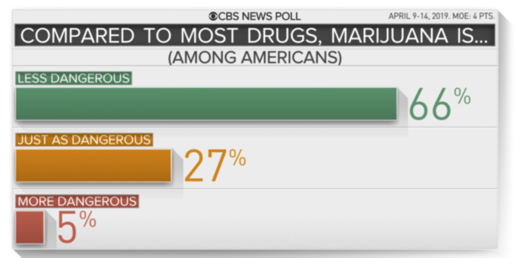

```{r setup, include=FALSE}
knitr::opts_chunk$set(echo = TRUE)
```
## Question 1 (get your previous points!) 
Keep working on your Shiny interfaces and packages! Complete any of the previous tasks you have not finished, and work to make your packages and interfaces better!

My updated shiny apps can be found in the Homework_2 folder of my github.

## Question 2 (20 points) 
Using the principles and guidelines from the data visualization lecture slides (we did not finish!), evaluate the plots in your Shiny interfaces (k means and basketball) and improve them! Also, add 3 more high-quality and highly-informative plots or tables to your interface. Use ggplot for all plots in the interface!

**NOTE:** I think I should have kept a record of my progression on my college basketball graphs, but I didn't other than my regular updates to github.

Firstly, the k-means shiny app doesn't have a color blind friendly color palette, and so I switch it to a palette I found on __http://www.cookbook-r.com/Graphs/Colors_(ggplot2)/__.

My first plot of Basketball Scores was very confusing because the team of interest could be represented on the x-axis (home) or y-axis (visitor). To make it easier to understand I altered the graph so the team of interest is always of the x-axis with their opponent on the y-axis. 

**Game Table:** I really love the adage, "sometimes a table is the best way to show the data." This table shows all of the games played by the selected team. Since there can be a lot of rows, I limited it to 10 rows at a time. In its first form the table was a copy of the KenPom data. One of the principles of good visualization is that objects being compared should be side by side. I changed my table so the two scores were placed next to each other in the table.

**Violin Graph:** I created this graph as a visual representation of the distribution of Score Differences for a selected team. The graph is a good visualization to me of on average how much a team win or loses a game by, and if they win (top heavy) or lose (bottom heavy) more often. One of the principles of good visualization is "Show the Data" and so I include data points in the violin as well. 
**Time Series Graph:** This graph shows the selected team's game score across the season as well as the opponents score. While I think this gives good information (trends in overall score), I would like to find a way to present it that is not as messy. A good example of its use is we can see for Idaho state that as the season has progressed, while they still lose frequently, the games have been a lot closer. 

**All Teams Graph:** Under the tab "All Team Data" there is a table showing the win percentages of all of the teams in the league. The teams are ranked by a weighted win percentage (wins^2 / total games) that gives favor to teams who have loss less games. Teams are shown 5 at a time, and there is a search bar to find a specific team. 

## Question 3 (20 points) 
Finish going through the examples from the ggplot lecture. Confirm in your RMarkdown that you completed this task (on your honor!).

On my honor, I completed the examples from the ggplot lecture. My updated RMarkdown can be found in my github under __Homework3/ggplot2_lecture/Exercises_ggplot2.Rmd__

## Question 4 (20 points) {.tabset}
Go find 5 solid examples where statistics have been misused, misrepresented (graphs), or misinterpreted. Add the link or graph to the RMarkdown document, and describe what they did wrong. What should they have done differently? Which of the 12 data science principles did they violate?

### Example 1
In the State of the Union speech given this year, President Biden quoted a statistic from the World Economic Form: 

***“America used to have the best roads, bridges, and airports on Earth. And now our infrastructure is ranked 13th in the world.”***

The Washington Post in a fact checking article (cited below) offered some insight as to why this statistic is misleading. The top 3 countries on that list are Singapore, Hong Kong, and the United Arab Emirates, all of which are small coastal cities. The rest above the United States are smaller, European countries that share infrastructure across the EU. Of top 10 largest countries in the world, the United States continues to have the best infrastructure. 

I claim that this act is in violation of the principle: **Present our work in ways that empower others to make better-informed decisions.** While Biden's fact is actually true, because not all of the information is presented it creates a feeling that the United States isn't doing as well as it could be. Ultimately this helps him in his quest to pass the infrastructure bill, but does not give voters all the information they need to make an informed decision. (This leads to further questions of if it the President's or our own responsibility to get all the information, but I won't go there now).

https://www.washingtonpost.com/politics/2022/03/01/fact-checking-president-bidens-2022-state-union-address/

### Example 2

The Hill, an American political newspaper, recently published an article titled, **Biden's approval rating jumps to 47 percent after State of the Union address** (cited below). This statistic is based off a single poll, the ___NPR-PBS NewsHour-Marist National Poll___, and the difference comes from the difference between his rating this month, March, and last month, February. This statistic is misleading because it is based off a single survey of 1,322 American Adults. In my mind, this violates the principle:L **Recognize and mitigate bias in ourselves and in the data we use,** since bias is introduced by a small sample size compared to the population. 

The site **fivethirtyeight** uses results from more than 50 polls to create a better picture of the President's actual approval rating. Their site is also listed below. According to their findings, Biden's average approval ratings changed by less than a percent from the beginning of February to now. 

https://thehill.com/homenews/administration/596890-bidens-approval-rating-jumps-to-47-percent-after-state-of-the-union-address

https://projects.fivethirtyeight.com/biden-approval-rating/?cid=rrpromo

### Example 3

In a CBS news article titled **Legalization of marijuana support hits a new high**, the below visualization is shown to offer support of why marijuana should be legal in the United States. While public opinion are useful data in many circumstances, I believe that data regarding health risks should not be left to public opinion. This graphic offers the idea that marijuana is less dangerous than other drugs because public opinion says so. 

To me, this is a violation of the principle **Clearly identify the questions and objectives that drive each project and use to guide both planning and refinement.** The claimed objective of this graphic is to show that marijuana is less dangerous than other drugs. Had the article writers been guided by this objective they would have sought data from medical experts rather than public opinion. 



### Example 4

Here is a story about the misinterpretation of data and its outcome on the Coca-Cola company. In 1985, Coca-Cola was losing the cola war to Pepsi. To try and turn the tide they decided to introduce a new flavor of Coke. Preliminary taste tests showed overwhelming evidence that people liked the taste of the new Cola over the original Coke and Pepsi. Based off this data, the company decided to discontinue the production of the original flavor and replace it with the new one. Customers were furious, and Coca-Cola lost the market war to Pepsi for a time. 

What the data was not able to show was the attachment the customers had to the original drink. The product was more than just a flavor, it was the name and familiarity that a lot of people had grown up with. In response to this outrage, Coca-Cola executives announced the return of the original flavor two and a half months after the release of the new flavor. 

Ultimately, this story actually follows the principle of: **Be open to changing our methods and conclusions in response to new knowledge.** I share it as a solid example of a misinterpretation of data though as the whole story was not told by the data that was gathered. The Coca-Cola company could potentially have avoided this mistake by exploring loyalty to their product by more than just taste. 

https://towardsdatascience.com/how-to-properly-tell-a-story-with-data-and-common-pitfalls-to-avoid-317d8817e0c9
https://www.snopes.com/fact-check/new-coke-fiasco/

### Example 5 

I found this article titled **The Battle for Digital Privacy Is Reshaping the Internet** by the New York Times to be very interesting. The article explains how big tech companies like Apple and Google are trying to give their users more control over their data privacy, rather than "secretly" collected all of their data. This works in conjunction with the principle: **Protect the privacy and security of individuals represented in our data.**

However, the article also presents that there are small businesses that rely on internet data collection practices and targeted advertising to run a successful business. The article specifically mentions the business "Seven Sisters Scones" who's revenue dropped from 40,000 to 16,000 after Apple blocked some ad tracking. "Apple declined to comment, but its executives have said advertisers will adapt" (NYTimes). This is in violation of the principal: **Respect and invite fair criticism while promoting the identification and opend discussion of unintended consequences of our work.**

https://www.nytimes.com/2021/09/16/technology/digital-privacy.html

### Example 6 

This link has a lot of good visualizations that I really liked and appreciated.

https://www.pewresearch.org/fact-tank/2022/02/25/state-of-the-union-2022-how-americans-view-major-national-issues/